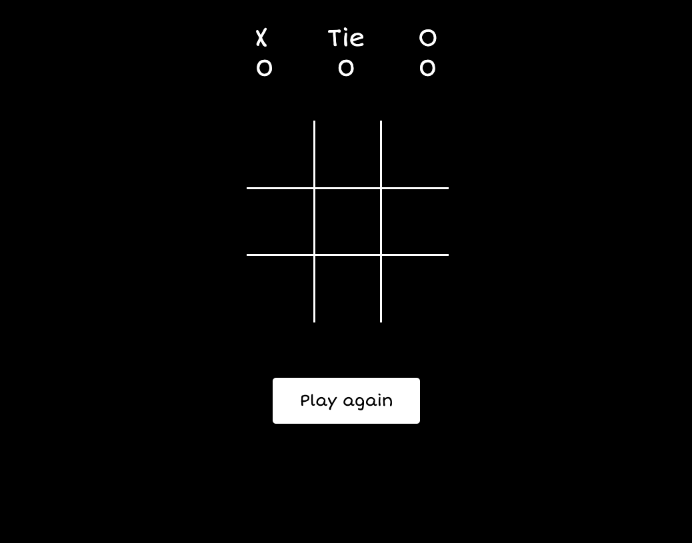

# Tic Tac Toe
Tic Tac Toe is a universally cherished classic game. The objective is simple: be the first to align three of your marks, whether horizontally, vertically, or diagonally, to win. As a browser-based version, you can relish this timeless game anytime and anywhere.

## :computer: [https://nwprojects.github.io/tic-tac-toe/](#) to see my live project!

## :page_facing_up: About
- How to use my awesome project.
- Download instructions (if relevant):
```zsh
$ git clone tic-tac-toe
$ cd tic-tac-toe
$ open index.html
```
 

## :pencil2: Planning & Problem Solving
- The project development involves first defining the basic requirements, quickly prototyping, then progressing through HTML, CSS, and JavaScript development, with ongoing testing for a streamlined process.
- Add screenshots/drawings of doodles/plans during the planning phase.
- Flow charts of app logic.(https://lucid.app/lucidchart/0d548038-f4d0-4c06-b626-5d0d5b128431/edit?viewport_loc=-3%2C-10%2C1531%2C1648%2C0_0&invitationId=inv_51a550c4-ba3e-4abc-95e1-28fcf71b0554)
- Wireframe(https://www.figma.com/file/1kMWdgxz0ESWHeQikIAvFU/Untitled?type=design&node-id=0%3A1&mode=design&t=O5PQxnluuzQT3ca6-1)

## :rocket: Cool tech
- Programming languages: HTML, CSS, JS

## :sob: Lessons learnt
Reflecting on the development of the Tic Tac Toe game, a key takeaway would be the importance of beginning with a minimal viable product (MVP) rather than overthinking or overcomplicating the initial stages.

## :white_check_mark: Future features
Cool things I would add if I can keep working on this:
- Incorporate Animations
- Implement Sound Effects
- Introduce Single Player Mode